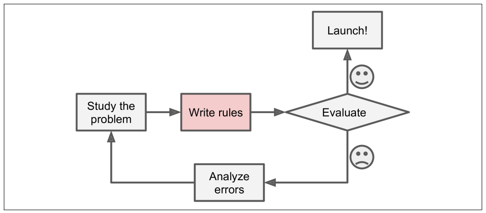

# 1. 한눈에 보는 머신러닝

<br>

<br>

## 1.1 머신러닝이란?

<br>

### 머신러닝

> Data에서부터 학습하도록 컴퓨터를 프로그래밍하는 과학 (또는 예술)

<br>

#### 일반적 정의

: 명시적인 프로그래밍 없이 컴퓨터가 학습하는 능력을 갖추게 하는 연구분야		- Arthur Samule, 1959

<br>

#### 공학적 정의

: 어떤 작업 T에 대한 컴퓨터 프로그램의 성능을 P로 측정했을 때 경험 E로 인해 성능이 향상됐다면, 이 컴퓨터 프로그램은 작업 T와 성능 측정 P에 대해 경험 E로 학습한 것이다.		- Tom Mitchell, 1997

<br>

- `T (작업)`

  : 새로운 메일이 스팸인지 구분하는 것

- `E (경험)`

  : 훈련 데이터 (스팸 메일이 포함된 메일 데이터)

- `P (성능 측정)`

  : 정확도 (accuracy)

<br>

### 훈련 세트 (Training Set)

: System이 학습하는 데 사용하는 샘플

<br>

### 훈련 사례 (training instance) 또는 샘플

: 각 훈련 data

<br>

<br>

## 1.2 왜 머신러닝을 사용하는가?

 <br>



<div align="center">[ 전통적인 접근 방법 ]</div>

<br>


<div align="center">[ 머신러닝 접근 방법 ]</div>

<br>


<div align="center">[ 자동으로 변화에 적응하는 머신러닝 ]</div>

<br>


<div align="center">[ 머신러닝을 통해 배울 수 있다 ]</div>

<br>

### Data mining

: 머신러닝 기술을 적용하여 대용량의 데이터를 분석하여 보이지 않던 패턴을 발견하는 것

<br>

### 머신 러닝은 다음과 같은 분야에 뛰어나다

1. 기존 solution으로는 많은 수동 조정과 규칙이 필요한 문제
   - 하나의 머신러닝 모델이 코드를 간단하게 만들고, 전통적인 방법보다 더 잘 수행되도록 할 수 있다
2. 전통적인 방식으로는 해결 방법이 없는 복잡한 문제
3. 유동적인 환경
   - 머신러닝 시스템은 새로운 데이터에 적응할 수 있다
4. 복잡한 문제와 대략의 데이터에서 통찰 얻기

<br>

<br>

## 1.3 애플리케이션 사례

> 내가 관심 있는 것 몇 가지만 정리!

<br>

- #### 생산 라인에서 제품 이미지를 분석해 자동으로 분류하기

  - 이미지 분류 작업
  - `합성공 신경망 (CNN: Convolution Neural Network)`

- #### Chatbot 또는 개인 비서 만들기

  - `자연어 이해 (NLU: Natural Language Understanding)`
  - `질문 - 대답 모듈 (Question-answering module)`
  - 등 여러가지 `NLP (Natural Language Processing) 컴포넌트`가 필요함

- #### 다양한 성능 지표를 기반으로 회사의 내년도 수익을 예측하기

  - `회귀 (regression)` 작업
    - 숫자로 값을 예측
  - `선형 회귀 (linear regression)`
  - `다항 회귀 (polynomial regression)`
  - `회귀 SVM (Support Vector Machine)`
  - `회귀 랜덤 포레스트 (random forest)`
  - `인공 신경망 (Artificial Neural Network)`
  - 등 회귀 모델을 사용하여 해결

- #### 음성 명령에 반응하는 앱 만들기

  - 음성 인식 작업
  - 오디오 샘플 처리
  - `순환 신경망 (RNN: Recurrent Neural Network)`
  - `합성곱 신경망 (CNN: Convolutional Neural Network)`
  - `Transformer` 사용

- #### 구매 이력을 기반으로 고객을 나누고 각 집합마다 다른 마케팅 전략을 계획하기

  - `군집 (clustering) ` 작업

- #### 과거 구매 이력을 기반으로 고객이 관심을 가질 수 있는 상품 추천하기

  - 추천 시스템
  - 과거 구매이력을 `인공 신경망 (Artificial Neural Network)` 에 주입하고 다음에 구매할 가능성이 가장 높은 상품을 출력하는 것이 한 가지 방법
  - 일반적으로 모든 고객의 구매 이력을 기반으로 훈련

<br><br>

## 1.4 머신러닝 시스템의 종류

<br>

#### 머신러닝 시스템의 종류는 굉장히 많으므로 넓은 범주에서 분류하면 도움이 됨!

- 사람의 감독하에 훈련 or not
  - `지도 학습 (Supervised Learning)`
  - `비지도 학습 (Unsupervised Learning)`
  - `준지도 학습 (Semisupervised Learning)`
  - `강화 학습 (Reinforcement Learning)`
- 실시간으로 점진적인 학습 or not
  - `온라인 학습`
  - `배치 학습`
- 단순하게 알고 있는 데이터 포인트와 새 데이터 포인트를 비교 or 과학자들이 하는 것처럼 훈련 데이터셋에서 패턴을 발견하여 예측 모델을 만드는지
  - `사례 기반 학습`
  - `모델 기반 학습`

<br>

<br>

### 1.4.1 지도 학습과 비지도 학습

> 학습하는 동안의 감독 형태나 정보량에 따른 분류

<br>

#### 지도 학습 (Supervised learning)

: 지도 학습에는 알고리즘에 주입하는 훈련 데이터에 **레이블 (label)** 이라는 원하는 답이 포함됨


<div align="center">
    [ Spam 분류를 위한 Label 된 훈련 세트 (지도 학습의 예) ]
</div>

<br>

- **분류 (classification)** 가 전형적인 지도 학습 작업임
- **예측 변수 (predictor variable)** 라 부르는 **특성 (feature)** 을 사용해 중고차 가격 같은 **타깃 (Target)** 수치를 예측하는 것도 전형적인 지도 학습 작업
  - 이런 종류의 작업을 `회귀 (regression)` 이라고 부름


<div align="center"> [  Regression - 주어진 입력 특성으로 값을 예측 ] </div>

<br>

**지도 학습 알고리즘들**

- `k-최근접 이웃 (k-nearest neightbors)`
- `선형 회귀  (linear regression)`
- `로지스틱 회귀 (logistic regression)`
- `서포트 벡터 머신 (SVM: Support Vector Machine)`
- `결정 트리 (decision tree)` 와 `랜덤 포레스트 (random forest)`
- `신경망 (neural networks)`

<br>

<br>

#### 비지도 학습 (Unsupervised Learning)

: 말 그대로 훈련 데이터에 레이블이 없음. 시스템이 아무런 도움 없이 학습해야 함!

<br>

**비지도 학습 알고리즘들**

- `군집 (clustering)`

  

  - **계층 군집 (hierarchical clustering)** 알고리즘을 사용하면 각 그룹을 더 작은 그룹으로 세분화 할 수 있음

  <br>

- `시각화 (visualization)` 와 `차원 축소 (dimensionality reduction)`

  - **시각화 알고리즘**
    - 레이블이 없는 대규모의 고차원 데이터를 넣으면 도식화가 가능한 2D나 3D 표현을 만들어줌
  - **차원 축소**
    - 너무 많은 작업을 잃지 않으면서 데이터를 간소화 하는 것
      - 상관 관계가 있는 여러 특성을 하나로 합치는 것 -> **특성 추출 (feature extraction)**
    - Tip ) 
      - 머신러닝 알고리즘에 데이터를 주입하기 전에 **차원 축소 알고리즘**을 사용하여 훈련 데이터의 차원을 줄이는 것이 유용할 때가 많음
        - 실행 속도가 훨씬 빨라짐
        - 디스크와 메모리를 차지하는 공간 줄어듦
        - 경우에 따라 성능이 좋아지기도 함 

  

  <div align="center">
      [ 의미 있는 군집을 강조한 t-SNE 시각화 예시 ]
  </div>

  <br>

- `이상치 탐지 (outlier detection)`

  - 학습 알고리즘에 주입하기 전에 데이터셋에서 **이상한 값**을 자동으로 **제거**하는 것

    - 시스템은 훈련하는 동안 대부분 정상 샘플을 만나 이를 인식하도록 훈련 됨
    - 그다음 새로운 샘플을 보고 정상 데이터인지 or 이상치인지 판단

    

    <div align="center"> [ 이상치 탐지 ] </div>

<br>

- `특이치 탐지 (novelty detection)`

  - 훈련 세트에 있는 모든 샘플과 **달라 보이는 새로운 샘플**을 탐지하는 것이 목적
  - 알고리즘으로 감지하고 싶은 모든 샘플을 제거한 후 매우 '깨끗한' 훈련 세트가 필요
  - ex)
    - 강아지 사진 수천장 중 1%가 치와와 사진이면 특이치 탐지 알고리즘은 구분 못함
    - but, 이상치 탐지 알고리즘은 치와와 사진을 매우 드물고 다르 강아지와 다르다고 인식

  <br>

- `연관 규칙 학습 (association rule learing)`
  
  - 대량의 데이터에서 특성 간의 흥미로운 관계를 찾는 것

<br>

<br>

#### 준지도 학습 (Semisupervised Learning)

- Data에 label을 다는 것은 일반적으로 시간과 비용이 많이 들기 때문에 label이 없는 sample이 많고 label 된 sample은 적은 경우가 많음

  - 어떤 알고리즘은 **일부만 label이 있는 data**를 다룸

    -> **준지도 학습**

- ex) 

  - 구글 포토 호스팅 서비스

    - 가족 사진을 올리면 사람 A는 1, 5, 11에 있고,  사람 B는 사진 2, 5, 7에 있다고 자동으로 인식

      -> **군집**

    - 사람마다 label을 추가하면 사진에 있는 모든 사람의 이름을 알 수 있고 편리하게 사진을 찾을 수 있음!

- 대부분의 준지도 학습은 지도 학습과 비지도 학습의 조합으로 이루어져 있음

   

<div align="center"> [ 두 개의 class를 사용한 준 지도 학습: 새로운 샘플(곱셈 기호)이 label이 있는 사각형 클래스에 더 가깝지만  label이 없는 샘플(원)이 이 샘플을 삼각형 클래스로 분류하는데 도움을 줌 ] </div>

<br>

<br>

#### 강화 학습 (Reinforcement Learning)

- 시스템을 **에이전트** 라고 부르며 환경을 관찰해서 행동을 실행하고 그 결과로 **보상 (reward)** 또는 **벌점 (penalty)**을 받음

- 시간이 지나면서 가장 큰 보상을 얻기 위해 **정책(policy)**이라고 부르는 최상의 전략을 스스로 학습함

  - 정책은 주어진 상황에서 에이전트가 어떤 행동을 선택해야 할지 정의함

   

<br>

<br>

### 1.4.2 배치 학습과 온라인 학습

> 입력 데이터의 스트림(stream)부터 점진적으로 학습할 수 있는지 여부

<br>

#### 배치 학습 (batch learning)

- 시스템이 점진적으로 학습할 수 없음
- 시간과 자원을 많이 많이 소모함
- 먼저 시스템을 훈련 시키고, 제품 시스템에 적용하면 더 이상의 학습 없이 실행됨
  - 학습한 것을 적용만 함
  - `오프라인 학습(Offline learning)`
- 새로운 데이터에 대해 학습하려면 전체 데이터를 사용하여 새로운 버전을 처음부터 다시 훈련해야 함
  - 간단하고 잘 동작하지만 시간이 오래 소요될 수 있음
    - 빠르게 변하는 데이터에 적응해야 한다면 (ex. 주식가격) 더 능동적인 방법 필요
  - 전체 데이터 셋을 사용해 훈련한다면 많은 컴퓨팅 자원 필요
    - 큰 비용 발생

<br>

#### 온라인 학습 (online learning)

- 데이터를 순차적으로 한 개 씩 or **`미니 배치(mini-batch)`** 라고 부루는 작은 묶음 단위로 주입하여 시스템을 훈련
- 매 학습 단계가 빠르고 비용이 적게 듦
  - 시스템은 데이터가 도착하는 대로 즉시 학습 할 수 있음


<div align="center"> [ Online learning ] </div>

- 연속적으로 데이터를 받고 (ex. 주식가격) 빠르 변화에 스스로 적응해야 하는 시스템에 적합

- 컴퓨팅 자원이 제한적일 때에도 좋음

  - why?

    - 온라인 학습 시스템이 새로운 데이터 샘플을 학습하면 학습이 끝난 데이터는 더이상 필요하지 않으므로 버리면 됨
      - 많은 공간 절약 가능!

    <br>

- **`외부 메모리 학습`**

  - 컴퓨터 한 대의 메인 메모리에 들어갈 수 없는 아주 큰 데이터 셋을 학습하는 것
    - 알고리즘이 데이터 일부를 읽어 들이고 훈련
    - 전체 데이터가 모두 적용될 때 까지 이 과정을 반복
  - 보통 offline으로 실행됨
    - 실시간 시스템에서 수행되는 것이 아님
    - 점진적 학습임

  

<div align="center"> [ Online learning을 활용하여 대량의 데이터를 처리하기 ]</div>

<br>

<br>

### 1.4.3 사례 기반 학습과 모델 기반 학습

> 어떻게 일반화 (좋은 예측을 만들어 내는지) 에 따르 분류

<br>

#### 사례 기반 학습 (Instance-based learning)

- 단순히 기억하는 것 (ex. spam filter)
  - 시스템이 훈련 샘플을 기억함으로써 학습함
  - 그리고 **유사도 측정** 을 사용해 새로운 데이터와 학습한 샘플을 비교하는 식으로 일반화

<br>

#### 모델 기반 학습 (Model based learning)

- 샘플들의 모델을 만들어 **예측**에 사용하는 것
- ex) 간단한 선형 모델 
  
  - 삶의 만족도 = θ0 + θ1 X (1인당GDP)
- **`모델 파라미터 (model parameter)`** 
  - **Theta** (**θ**) 를 활용하여 주로 표현함
    - **Omeaga (Ω)**
    - **Beta (ß)** 

- 모델을 사용하기 전에 `θ0`  과 `θ1` 를 정의해야 함

  - 최상의 값을 내도록 하는 값을 알기 위해 **`측정 지표`** 정하기 

    - 효용함수
      - 모델이 얼마나 좋은지 츨정
    - 비용 함수
      - 모델이 얼마나 나쁜지 측정

  - **`선형회귀`**에서는보통 선형 모델의 예측과 훈련 데이터 사이의 거리를 재는 **비용 함수**를 사용

    - 이 거리를 최소화 하는 것이 목표!

    - **회귀**

      : 연속적인 타깃을 예측하는 알고리즘

<br>

> **예제 1-1** Scikit-Learn을 이용한 선형 모델의 훈련과 실행

```python 
# 예제 코드
import matplotlib.pyplot as plt
import numpy as np
import pandas as pd
import sklearn.linear_model

# 데이터 적재
oecd_bli = pd.read_csv(datapath + "oecd_bli_2015.csv", thousands=',')
              # [ pandas.read_csv ]
              # : Read a comma-separated values (csv) file into DataFrame.
gdp_per_capita = pd.read_csv(datapath + "gdp_per_capita.csv",thousands=',',delimiter='\t',
                             encoding='latin1', na_values="n/a")

# 데이터 준비
country_stats = prepare_country_stats(oecd_bli, gdp_per_capita)
X = np.c_[country_stats["GDP per capita"]]
y = np.c_[country_stats["Life satisfaction"]]
    # [ numpy.c_ ]
    # : Translates slice objects to concatenation along the second axis.

# 데이터 시각화
country_stats.plot(kind='scatter', x="GDP per capita", y='Life satisfaction')
        # plt.plot()은 라인 플롯을 그리는 함수
plt.show()

# 선형 모델 선택
model = sklearn.linear_model.LinearRegression()
        # 사이킷런의 LinearRegression 클래스는 사이파이SciPy의 lstsq() 함수를 사용하여 선형 회귀 문제를 품
        # -> 특잇값 분해(SVD) 방식을 사용하여 유사 역행렬을 계산

"""
선형 회귀 모델을 K-최근접 이웃 (K-nearest neightbors) 회귀로 바꾸기
"""
# import sklearn.neighbors
# model = sklearn.neighbors.KNeighborsRegressor(n_neighbors=3)

# 모델 훈련
model.fit(X, y)

# 키프로스에 대한 예측
X_new = [[22587]]  # 키프로스 1인당 GDP
print(model.predict(X_new)) # 출력 [[ 5.96242338]]
```

<br>

#### 지금까지의 작업 요약

1. 데이터를 **분석**
2. `모델`을 **선택**
3. `훈련 데이터`로 모델을 **훈련**
4. 새로운 데이터에 모델을 **적용**해 **예측**을 하고 (`추론`), 이 모델이 잘 **일반화** 되기를 기대함 

<br>

<br>

## 1.5 머신러닝의 주요 도전 과제

> 학습 알고리즘을 선택해서 데이터에 훈련시키는 과정에서 문제가 될 수 있는 두 가지
>
> 1. 나쁜 알고리즘
> 2. 나쁜 데이터

<br>

### 1.5.1 충분하지 않은 양의 훈련 데이터

- 대부분의 머신러닝 알고리즘이 잘 작동하려면 데이터가 많아야 함
  - 아주 간단한 문제에서조차도 수천개의 데이터가 필요하고, 이미자 음성 인식 같은 복잡한 문제라면 수백만개가 필요할지도 모름

<br>

### 1.5.2 대표성 없는 훈련 데이터

- 일반화 하려는 사례들을 대표하는 훈련세트를 사용하는 것이 중요하지만, 어려울 때가 많음
  - 샘플이 작으면 `샘플링 잡읍 (sampling noise)` 발생
    - **샘플링 잡음**은 우연에 의한 대표성 없는 데이터를 뜻함
  - 매우 큰 샘플도 표본 추출 방법이 잘못되면 대표성을 띠지 못할 수도 있음
    - `샘플링 편향 (smpling bias)`

<br>

### 1.5.3 낮은 품질의 데이터

- 훈련 데이터가 `에러`, `이상치 (outlier)`, `잡음` 으로 가득하다면 머신러닝 시스템이 내재된 **패턴**을 찾기 어려워 잘 작동하지 않을 것임
  - **훈련 데이터 정제**에 많은 시간을 투자해야 한다!

<br>

### 1.5.4 관련 없는 특성

- 성공적인 머신러닝 프로젝트의 핵심 요소는 훈련에 사용할 **좋은 특성**들을 찾는 것
  - 이 과정을 `특성 공학 (feature engineering)` 이라고 함
    1. **특성 선택 (feature selection)**
       - 가지고 있는 특성 중에서 훈련에 가장 유용한 특성을 선택
    2. **특성 추출 (feature extraction)**
       - 특성을 결합하여 더 유용한 특성을 만듦
       - `차원 축소 알고리즘`이 도움이 될 수 잇음
    3. 새로운 데이터를 수집해 새 특성을 만들기

<br>

### 1.5.5 훈련 데이터 과대적합

- **과대적합 (overfitting)**
  - 훈련 데이터에 잘 맞지만, 일반성이 떨어진다는 뜻
  - 훈련 데이터에 있는 잡음의 양에 비해 모델이 너무 복잡할 때 발생
    - `해결 방법`
      - 단순화 하기
        - Parameter 수가 적은 모델을 선택 (ex. 고차원 다항 모델보다 선형 모델)
        - 훈련 데이터에 있는 특성 수 줄이기
        - 모델에 제약을 가하기
      - 훈련 데이터를 더 많이 모으기
      - 훈련 데이터의 잡음을 줄이기 (ex. 오류 데이터 수정과 이상치 (outlier) 제거)
- **규제 (regularization)**
  - 모델을 단순하게 하고 과대 적합의 위험을 감소시키기 위해 모델에 `제약`을 가하는 것
  - 학습하는 동안 적용할 규제의 양은 `하이퍼파라미터 (hyperparameter)` 가 결정함
    - **하이퍼파라미터** == 학습 알고리즘의 파라미터

<br>

### 1.5.6 훈련 데이터 과소적합

- 모델이 너무 단순해서 데이터의 내재된 구조를 학습하지 못할 때 일어남
  - 모델이 너무 **단순**해서 데이터의 **내재된 구조**를 학습하지 못할 때 일어남
- `해결 방법`
  - 모델 파라미터가 더 많은 강력한 모델을 선택
  - 학습 알고리즘에 더 좋은 특성을 제공 (`특성 공학`)
  - 모델의 제약을 줄임 (ex. 규제 하이퍼 파라미터를 감소시키기)

<br>

<br>

## 1.6 테스트와 검증

- 모델이 새로운 샘플에 얼마나 잘 일반화 될 지 알기 위해서는 새로운 샘플에 실제로 적용해 보아야 함
  - `적용 방법`
    - 훈련 데이터를 **훈련 세트**와 **테스트 세트**로 나누기
    - 새로운 샘플에 대한 오류 비율을 `일반화 오차 (generalization error)` or `외부 샘플 오차 (out-of-sample error)` 라고 함
      - 테스트 세트에서 모델을 평가함으로써 이 오차에 대한 추정값을 얻을 수 있음
      - 이 값으로 새로운 샘플에 모델이 얼마나 잘 동작할 지 알 수 있음
    - 훈련 세트에서는 모델의 오차가 적지만, 새로운 샘플에서는 오차가 높다면 (일반화 오차가 높다면) 모델이 훈련 데이터에 **과대적합 (overfitting)** 되었다는 뜻임!

<br>

### 1.6.1 하이퍼파라미터 튜닝과 모델 선택

- 두 모델 중 어느 것을 선택할 지 정하기 위해서는 두 모델 모두 **훈련 세트**로 훈련하고, **테스트 세트**를 사용해 얼마나 잘 `일반화` 되는지 비교하면 됨

- 둘 중 한 모델이 더 잘 일반화되었다고 가정하고 과대적합 (overfitting)을 피하기 위해 규제를 적용

  - 하이퍼파라미터 값으로는 100개의 하이퍼파라미터 값으로 100개의 다른 모델을 훈련 시키는 방법이 있음
- But, 성능이 좋지 않음
  
  - why?
      - 일반화 오차를 테스트 세트에서 여러번 측정했으므로 **모델**과 **하이퍼파라미터**가 테스트 세트에 최적화된 모델을 만들었기 때문
      - 모델이 새로운 데이터에 잘 작동하지 않을 수 있다는 뜻
  
  - 해결 방법
    - **홀드아웃 검증 (Holdout validation)**
      - 훈련 세트의 일부를 떼어내어 여러 후보 모델을 평가하고 가장 좋은 하나를 선택
        - 새로운 홀드아웃 세트를 `검증 세트 (validation set)` 라고 부름
      - 검증 세트에서 가장 높은 성능을 내는 모델을 선택
    - 홀드아웃 검증 과정이 끝나면 검증 세트를 포함한 최선의 모델을 전체 훈련 세트에서 다시 훈련하여 최종 모델을 만듦
    - 최종 모델을 테스트 세트에서 평가하여 **일반화 오차**를 수정
  - But, 일반적으로는 잘 작동하지만, 검증 세트가 너무 작으면 모델이 정확하게 평가되지 않음
    - 해결 방법
      - 작은 검증 세트를 여러 개를 사용해 반복적인 **교차 검증 (Cross-validation)** 을 수행
        - 검증 세트마다 나머지 데이터에서 훈련한 모델을 해당 검증 세트에서 평가
        - 모든 모델의 평가를 평균하면 훨씬 정확한 성능 측정 가능!
          - But, 훈련 시간이 검증 세트의 개수에 비례해 늘어남

<br>

### 훈련-개발 세트 (train-dev set)

> 훈련 세트의 일부를 떼어내어 또 다른 세트를 만드는 것

- 모델을 **훈련 세트**에서 훈련한 다음 **훈련-개발 세트**에서 평가
  - 모델이 잘 작동한다면 훈련 세트에 과대 적합 (overfitting) 된 것이 아님
    - 모델이 검증 세트에서 나쁜 성능을 낸다면 문제의 원인은 **데이터 불일치**
  - 모델이 잘 작동하지 않으면 훈련 세트에 과대 적합 된 것!
    - 모델을 규제하거나 
    - 더 많은 훈련 데이터를 모으거나
    - 훈련 데이터 정제를 시도해야 함

<br>

<br>

## Wrap-up

1. Machine Learning 정의
   - 머신러닝은 데이터로부터 학습할 수 있는 시스템을 만드는 것
     - 학습이란 어던 작업에서 주어진 성능 지표가 더 나아지는 것을 의미!
2. Machine Learning이 도움을 줄 수 있는 문제 유형 4 가지
   - 명확한 해결책이 없는 복잡한 문제
   - 수작업으로 만든 긴 규칙 리스트를 대체하는 경우
   - 변화하는 환경에 적응하는 시스템을 만드는 경우
   - 사람에게 통찰을 제공해야 하는 겨우
     - ex) data mining
3. 레이블 된 훈련 세트란?
   - 각 샘플에 대해 원하는 정답 (label) 을 담고 있는 훈련 세트 
4. 가장 널리 사용되는 지도 학습 작업 두 가지
   - 회귀
   - 분류
5. 보편적인 비지도 학습 작업 네 가지
   - 군집
   - 시각화
   - 차원 축소
   - 연관 규칙 학습
6. 사전 정보가 없는 여러 지형에서 로봇을 걸어가게 하려면 어떤 종류의 Machine Learning 알고리즘을 사용?
   - 강화 학습
     - 전형적으로 강화 학습이 다루는 유형의 문제임
     - 이 문제를 지도 학습이나 비지도 학습으로 표현하는 것도 가능하지만 일반적이지 않음!
7. 고객을 여러 그룹으로 분할하려면 어떤 알고리즘을 사용?
   - 그룹을 어떻게 정의할지 모를 때
     - 비슷한 고객끼리 군집으로 나누기 위해 군집 알고리즘 (비지도 학습) 사용 가능
   - 어떤 그룹이 있어야 할지 알 때
     - 분류 알고리즘 (지도학습) 에 각 그룹에 대한 샘플을 주입
       - 알고리즘이 전체 고객을 분류하게 됨
8. 스팸 감지의 문제는 지도 학습과 비지도 학습 중 어떤 문제?
   - 스팸 감지는 전형적인 지도 학습 문제!
     - 알고리즘에 많은 이메일과 이에 상응하는 레이블 (스팸 or 스팸 아님) 이 제공됨
9. 온라인 학습 시스템이란?
   - 배치 학습 시스템과 달리 점진적으로 학습할 수 있음
   - 변화하는 데이터와 자율 시스템에 빠르게 적응하고 많은 양의 데이터를 훈련 시킬 수 있음
10. 외부 메모리 학습이란?
    - 컴퓨터의 주메모리에 들어갈 수 없는 대용량의 데이터를 다룰 수 있음
    - 데이터를 미니배치로 나누고, 온라인 학습 기법을 사용해 학습
11. 예측을 하기 위해 유사도 측정에 의존하는 학습 알고리즘은?
    - 인스턴스 기반 학습
      - 훈련 데이터를 기억하는 학습
      - 새로운 샘플이 주어지면 유사도 측정을 사용해 학습된 샘플 중에서 가장 비슷한 것을 찾아 예측으로 사용
12. 모델 파라미터와 학습 알고리즘의 하이퍼파라미터의 차이
    - 모델은 하나 이상의 파라미터를 사용해 새로운 샘플이 주어지면 무엇을 예측할지 결정
    - 학습 알고리즘은 모델이 새로운 샘플에 잘 일반화되도록 이런 파라미터들의 최적값을 찾음
      - 하이퍼 파라미터는 모델이 아니라 이런 **학습 알고리즘 자체의 파라미터**
13. 모델 기반 알고리즘이 찾는 것 / 성공을 위해 이 알고리즘이 사용하는 일반적인 전략 / 예측을 만드는 방법
    - 모델 기반 학습 알고리즘은 새로운 샘플에 잘 일반화되기 위한 모델 파라미터의 최적값을 찾음
    - 일반적으로 훈련 데이터에서 시스템의 예측이 얼마나 나쁜지 측정하고, 모델에 규제가 있다면 모델 복잡도에 대한 패널티를 더한 비용 함수를 최소화함으로써 시스템을 훈련
    - 예측을 만들려면 학습 알고리즘이 찾은 파라미터를 사용하는 모델의 예측 함수에 새로운 샘플의 특성을 주입
14. Machine Learning의 주요 도전 과제
    - 부족한 데이터
    - 낮은 데이터 품질
    - 대표성 없는 데이터
    - 무의미한 특성
    - 훈련 데이터에 과소적합된, 과도하게 간단한 모델
    - 훈련 데이터에 과대적합된, 과도하게 복잡한 모델
15. 모델이 훈련 데이터에서의 성능은 좋지만 새로운 샘플에서의 일반화 성능이 나쁘다면 어떤 문제? / 가능한 해결책은?
    - 모델이 훈련 데이터에서는 잘 작동하지만 새로운 샘플에서는 형편없다면 이 모델은 훈련 데이터에 **과대적합** 되었을 가능성이 높음
    - 과대적합에 대한 해결책
      - 더 많은 데이터 모으기
      - 모델을 단순화
        - 간단한 알고리즘을 선택
        - 특성이나 파라미터 수 줄이기
        - 모델에 규제를 추가하기 등
      - 훈련 데이터에 있는 잡음을 감소
16. 테스트 세트란? 왜 사용하는가?
    - 테스트 세트는 실전에 배치되기 전에 모델이 새로운 샘플에 대해 만들 일반화 오차를 추정하기 위해 사용
17. 검증 세트의 목적은?
    - 검증 세트는 모델을 비교하는데 사용
      - 검증 세트를 사용해 가장 좋은 모델을 고르고 하이퍼파라미터를 튜닝
18. 훈련 - 개발 세트란? 언제 필요? 어떻게 사용?
    - 훈련 - 개발 세트는
      - 검증
      - 테스트 세트에 사용되는 데이터와 훈련 세트 사이에 데이터 불일치 위험이 있을 때 사용
    - 훈련 세트의 일부에서 모델을 훈련하고, 훈련 - 개발 세트와 검증 세트에서 평가
    - 모델이 훈련 세트에서 잘 동작하지만 훈련 - 개발 세트에서 나쁜 성능을 낸다면 
      - 훈련 세트에 과대 적합 되었을 가능성이 높음
    - 훈련 세트와 훈련 - 개발 세트에서 모두 잘 동작하지만 개발 세트에서 성능이 나쁘다면 
      - 훈련 데이터와 검증 + 테스트 데이터 사이에 **데이터 불일치**가 있을 가능성이 높음
        - 검증 + 테스트 데이터에 더 가깝게 되도록 훈련 데이터를 개선해야 함
19. 테스트 세트를 사용해 하이퍼파라미터를 할 때 문제점?
    - 테스트 세트를 사용해 하이퍼파라미터를 튜닝하면 테스트 세트에 과대 접합 될 위험이 있고, 일반화 오차를 낙관적으로 측정하게 됨
      - 모델을 출시하면 기대보다 나쁜 성능을 낼 것!