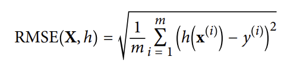

# 2. 머신러닝 프로젝트 처음부터 끝까지

> 부동산 회사에 고용된 데이터 과학자라고 가정하고 예제 프로젝트의 처음부터 끝까지 진행

 

 

## 2.1 실제 데이터로 작업하기

 

- 머신러닝을 배울 때는 인공적으로 만들어진 data set이 아닌 실제 data로 실험해 보는 것이 좋다
- 이 장에서는 `캘리포니아 주택 가격(California Housing Prices)` data set을 사용함
  - 1990년 캘리포니아 인구조사 data를 기반으로 만들어짐

 

 

## 2.2 큰 그림 보기

>  우선, 캘리포니아 인구조사 데이터를 사용해 캘리포니아의 주택 가격 모델을 만들어야 함

 

- `캘리포니아 주택 가격` 데이터는 블록 그룹( block group) 마다 인구(polulation), 중간 소득(median income), 중간 주택 가격(median housing price)등을 담고 있음
  - **블록 그룹**은 미국 인구 조사국에서 샘플 데이터를 발표하는데 사용하는 지리적 단위
- 이 데이터로 모델을 학습시켜서 다른 측정 데이터가 주어졌을 때 구역의 중간 주택 가격을 예측해야 함

 

### 2.2.1 문제 정의

- 목적을 먼저 정하는 것이 중요
  - why?
    - 목적을 아는 것은 
      - 문제를 어떻게 구성할지
      - 어떤 알고리즘을 선택할지
      - 모델 평가에 어떤 성능 지표를 사용할지
      - 모델 튜닝을 위해 얼마나 노력을 투여할지 결정하기 때문
- 문제를 정의하기
  - 레이블 된 훈련 샘플이 있으므로 **지도 학습**
    - 각 샘플이 기대 출력 값 (구역의 중간 주택 가격)을 가지고 있음
  - 값을 예측해야 하므로 **회귀 (regression) 문제**
    - 예측에 사용할 특성이 여러 개 (구역의 인구, 중간 소득 등)이므로 **다중 회귀 (multiple regression) 문제**
    - 각 구역마다 하나의 값을 예측하므로 **단변량 회귀 (univariate regression) 문제**
  - **배치 학습**
    - why?
      - 시스템으로 들어오는 데이터에 연속적인 흐름이 없으므로 빠르게  변하는 데이터에 적응하지 않아도 되고,
      - 데이터가 메모리에 들어갈 만큼 충분히 작으므로 일반적인 **배치 학습** 이 적절함

 

### 2.2.2 성능 측정 지표 선택

- 회귀 문제의 전형적인 성능 지표는 `평균 제곱근 오차 (RMSE: Root Mean Square Error)`

  - 오차가 커질수록 이 값이 더 커지므로 예측에 얼마나 많은 오류가 있는지 가늠하게 해줌!

    

    - `m` : RMSE를 측정할 데이터 셋에 있는 샘플 수
    - `x(i)` : 데이터 셋에 있는 (레이블을 제외한) i번째 샘플의 전체 특성값의 벡터
    - `y(i)` : 해당 레이블 (= 해당 샘플의 기대 출력값)
    - `X` : 데이터 셋이 있는 (레이블을 제외한) 모든 샘플의 모든 특성값을 포함하는 행렬
    - `h` : 시스템의 예측 함수, **가설 (hypothesis)**

 

### 2.2.3 가정 검사

- 마지막으로 지금까지 만든 가정을 나열하고 검사해보는 것이 좋다!

 

 

## 2.3 데이터 가져오기

> https://github.com/rickiepark/handson-ml2/blob/master/02_end_to_end_machine_learning_project.ipynb

