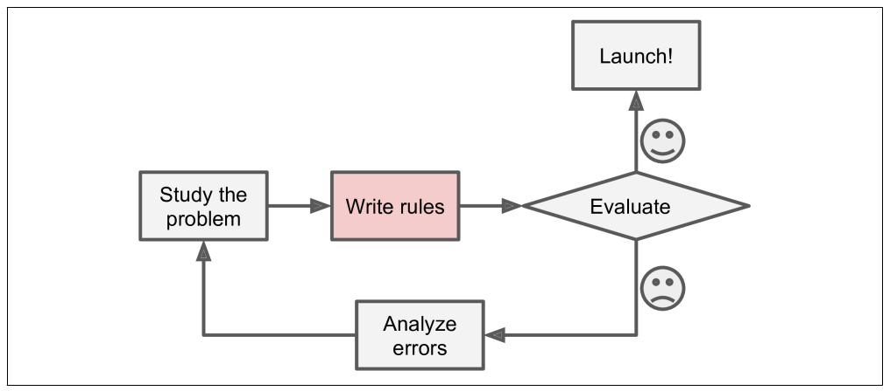
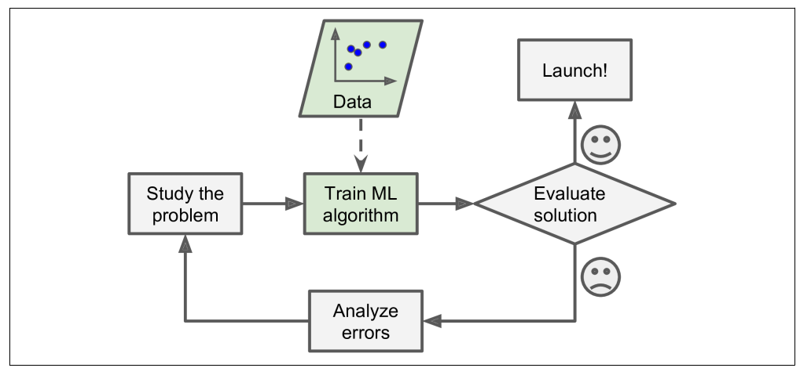
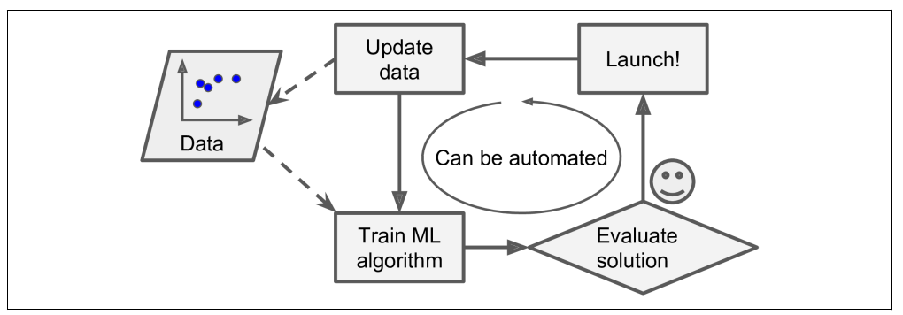
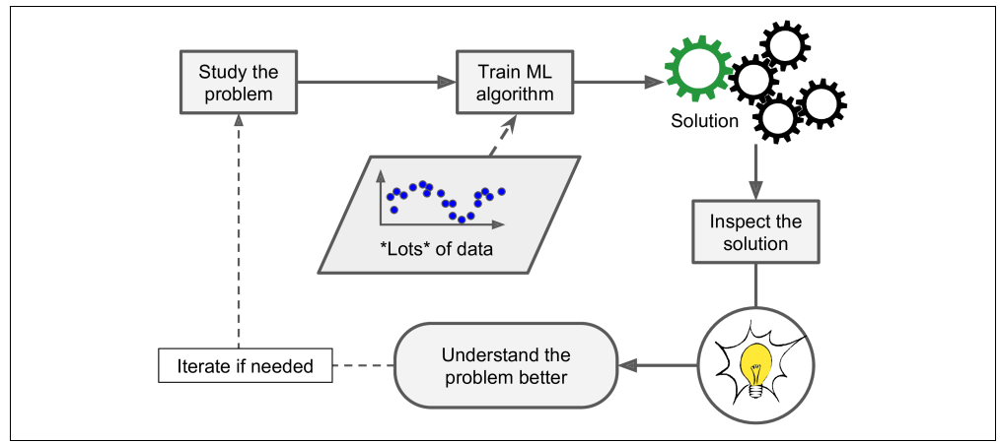
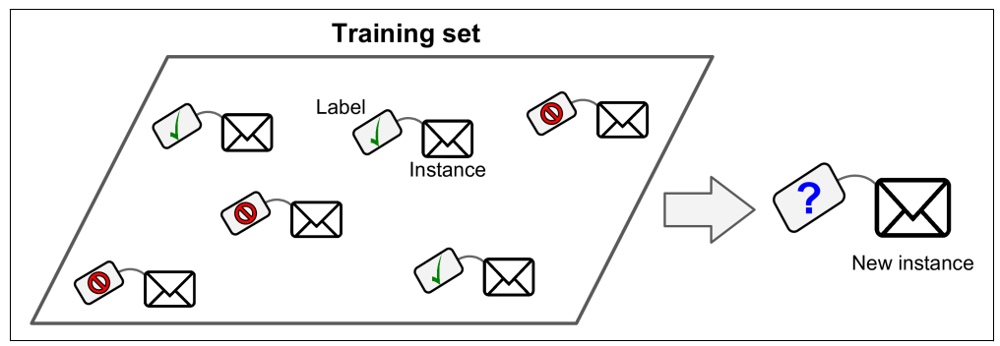
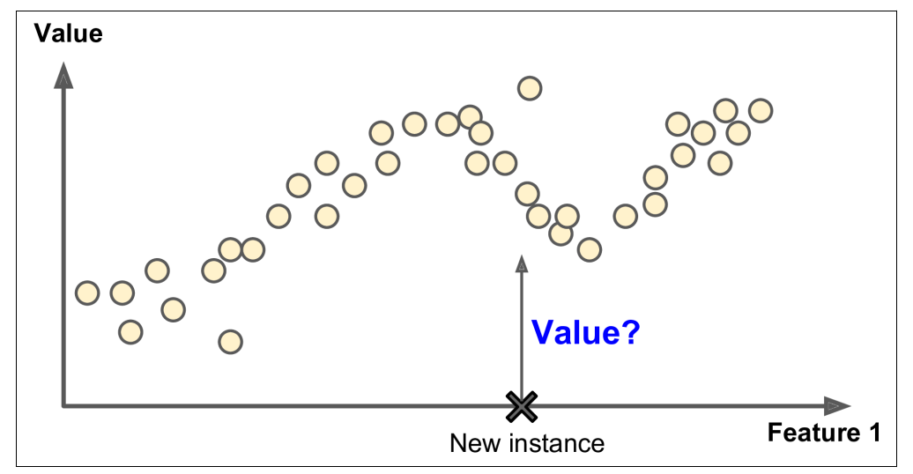
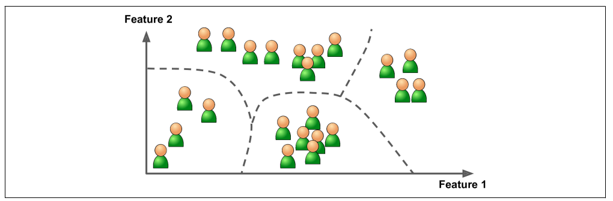
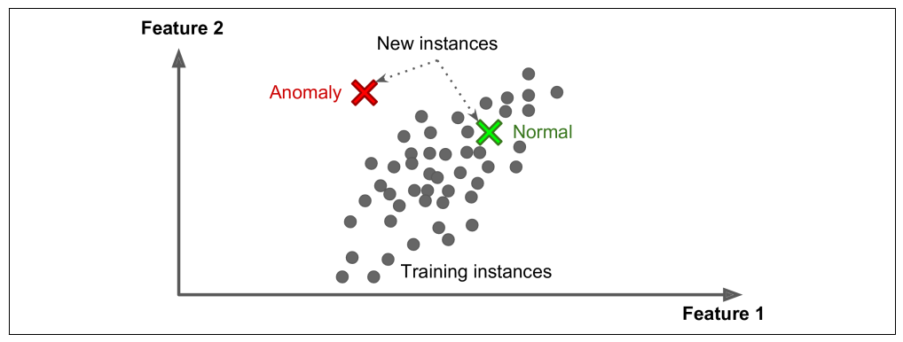
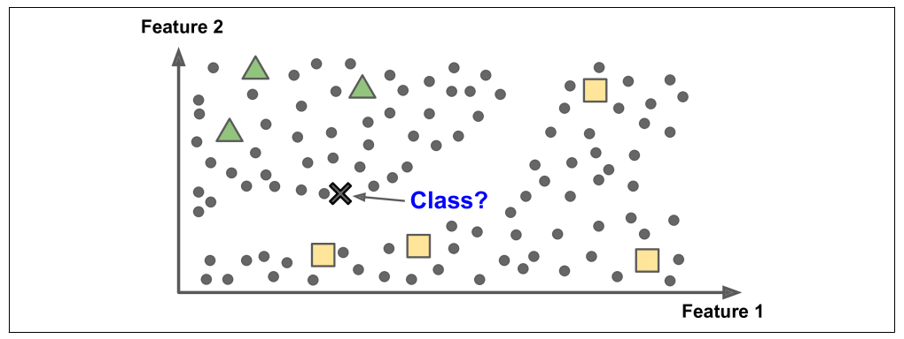
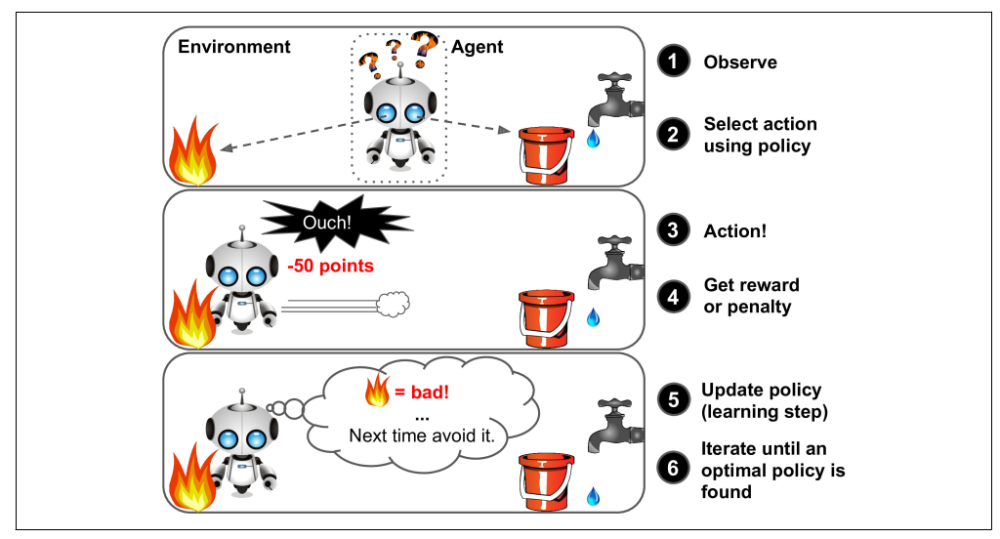

# 1. 한눈에 보는 머신러닝

## 1.1 머신러닝이란?

### 머신러닝

> Data에서부터 학습하도록 컴퓨터를 프로그래밍하는 과학 \(또는 예술\)

#### 일반적 정의

: 명시적인 프로그래밍 없이 컴퓨터가 학습하는 능력을 갖추게 하는 연구분야 - Arthur Samule, 1959

#### 공학적 정의

: 어떤 작업 T에 대한 컴퓨터 프로그램의 성능을 P로 측정했을 때 경험 E로 인해 성능이 향상됐다면, 이 컴퓨터 프로그램은 작업 T와 성능 측정 P에 대해 경험 E로 학습한 것이다. - Tom Mitchell, 1997

* `T (작업)`

  : 새로운 메일이 스팸인지 구분하는 것

* `E (경험)`

  : 훈련 데이터 \(스팸 메일이 포함된 메일 데이터\)

* `P (성능 측정)`

  : 정확도 \(accuracy\)

### 훈련 세트 \(Training Set\)

: System이 학습하는 데 사용하는 샘플

### 훈련 사례 \(training instance\) 또는 샘플

: 각 훈련 data

## 1.2 왜 머신러닝을 사용하는가?

\[ 전통적인 접근 방법 \]

\[ 머신러닝 접근 방법 \]

\[ 자동으로 변화에 적응하는 머신러닝 \]

\[ 머신러닝을 통해 배울 수 있다 \]

### Data mining

: 머신러닝 기술을 적용하여 대용량의 데이터를 분석하여 보이지 않던 패턴을 발견하는 것

### 머신 러닝은 다음과 같은 분야에 뛰어나다

1. 기존 solution으로는 많은 수동 조정과 규칙이 필요한 문제
   * 하나의 머신러닝 모델이 코드를 간단하게 만들고, 전통적인 방법보다 더 잘 수행되도록 할 수 있다
2. 전통적인 방식으로는 해결 방법이 없는 복잡한 문제
3. 유동적인 환경
   * 머신러닝 시스템은 새로운 데이터에 적응할 수 있다
4. 복잡한 문제와 대략의 데이터에서 통찰 얻기

## 1.3 애플리케이션 사례

> 내가 관심 있는 것 몇 가지만 정리

* **생산 라인에서 제품 이미지를 분석해 자동으로 분류하기**
  * 이미지 분류 작업
  * `합성공 신경망 (CNN: Convolution Neural Network)`
* **Chatbot 또는 개인 비서 만들기**
  * `자연어 이해 (NLU: Natural Language Understanding)`
  * `질문 - 대답 모듈 (Question-answering module)`
  * 등 여러가지 `NLP (Natural Language Processing) 컴포넌트`가 필요함
* **다양한 성능 지표를 기반으로 회사의 내년도 수익을 예측하기**
  * `회귀 (regression)` 작업
    * 숫자로 값을 예측
  * `선형 회귀 (linear regression)`
  * `다항 회귀 (polynomial regression)`
  * `회귀 SVM (Support Vector Machine)`
  * `회귀 랜덤 포레스트 (random forest)`
  * `인공 신경망 (Artificial Neural Network)`
  * 등 회귀 모델을 사용하여 해결
* **음성 명령에 반응하는 앱 만들기**
  * 음성 인식 작업
  * 오디오 샘플 처리
  * `순환 신경망 (RNN: Recurrent Neural Network)`
  * `합성곱 신경망 (CNN: Convolutional Neural Network)`
  * `Transformer` 사용
* **구매 이력을 기반으로 고객을 나누고 각 집합마다 다른 마케팅 전략을 계획하기**
  * `군집 (clustering)` 작업
* **과거 구매 이력을 기반으로 고객이 관심을 가질 수 있는 상품 추천하기**
  * 추천 시스템
  * 과거 구매이력을 `인공 신경망 (Artificial Neural Network)` 에 주입하고 다음에 구매할 가능성이 가장 높은 상품을 출력하는 것이 한 가지 방법
  * 일반적으로 모든 고객의 구매 이력을 기반으로 훈련

## 1.4 머신러닝 시스템의 종류

#### 머신러닝 시스템의 종류는 굉장히 많으므로 넓은 범주에서 분류하면 도움이 됨!

* 사람의 감독하에 훈련 or not
  * `지도 학습 (Supervised Learning)`
  * `비지도 학습 (Unsupervised Learning)`
  * `준지도 학습 (Semisupervised Learning)`
  * `강화 학습 (Reinforcement Learning)`
* 실시간으로 점진적인 학습 or not
  * `온라인 학습`
  * `배치 학습`
* 단순하게 알고 있는 데이터 포인트와 새 데이터 포인트를 비교 or 과학자들이 하는 것처럼 훈련 데이터셋에서 패턴을 발견하여 예측 모델을 만드는지
  * `사례 기반 학습`
  * `모델 기반 학습`

### 1.4.1 지도 학습과 비지도 학습

> 학습하는 동안의 감독 형태나 정보량에 따른 분류

#### 지도 학습 \(Supervised learning\)

: 지도 학습에는 알고리즘에 주입하는 훈련 데이터에 **레이블 \(label\)** 이라는 원하는 답이 포함됨

 \[ Spam 분류를 위한 Label 된 훈련 세트 \(지도 학습의 예\) \]

* **분류 \(classification\)** 가 전형적인 지도 학습 작업임
* **예측 변수 \(predictor variable\)** 라 부르는 **특성 \(feature\)** 을 사용해 중고차 가격 같은 **타깃 \(Target\)** 수치를 예측하는 것도 전형적인 지도 학습 작업
  * 이런 종류의 작업을 `회귀 (regression)` 이라고 부름

 \[ Regression - 주어진 입력 특성으로 값을 예측 \]

**지도 학습 알고리즘들**

* `k-최근접 이웃 (k-nearest neightbors)`
* `선형 회귀  (linear regression)`
* `로지스틱 회귀 (logistic regression)`
* `서포트 벡터 머신 (SVM: Support Vector Machine)`
* `결정 트리 (decision tree)` 와 `랜덤 포레스트 (random forest)`
* `신경망 (neural networks)`

#### 비지도 학습 \(Unsupervised Learning\)

: 말 그대로 훈련 데이터에 레이블이 없음. 시스템이 아무런 도움 없이 학습해야 함!

**비지도 학습 알고리즘들**

* `군집 (clustering)`

  

  * **계층 군집 \(hierarchical clustering\)** 알고리즘을 사용하면 각 그룹을 더 작은 그룹으로 세분화 할 수 있음

* `시각화 (visualization)` 와 `차원 축소 (dimensionality reduction)`

  * **시각화 알고리즘**
    * 레이블이 없는 대규모의 고차원 데이터를 넣으면 도식화가 가능한 2D나 3D 표현을 만들어줌
  * **차원 축소**
    * 너무 많은 작업을 잃지 않으면서 데이터를 간소화 하는 것
      * 상관 관계가 있는 여러 특성을 하나로 합치는 것 -&gt; **특성 추출 \(feature extraction\)**
    * Tip \) 
      * 머신러닝 알고리즘에 데이터를 주입하기 전에 **차원 축소 알고리즘**을 사용하여 훈련 데이터의 차원을 줄이는 것이 유용할 때가 많음
        * 실행 속도가 훨씬 빨라짐
        * 디스크와 메모리를 차지하는 공간 줄어듦
        * 경우에 따라 성능이 좋아지기도 함 

  

   \[ 의미 있는 군집을 강조한 t-SNE 시각화 예시 \]

* `이상치 탐지 (outlier detection)`
  * 학습 알고리즘에 주입하기 전에 데이터셋에서 이상한 값을 자동으로 제거하는 것

    * 시스템은 훈련하는 동안 대부분 정상 샘플을 만나 이를 인식하도록 훈련 됨
    * 그다음 새로운 샘플을 보고 정상 데이터인지 or 이상치인지 판단

    

     \[ 이상치 탐지 \]
* `특이치 탐지 (novelty detection)`
  * 훈련 세트에 있는 모든 샘플과 달ㄹ라 보이는 새로운 샘플을 탐지하는 것이 목적
  * 알고리즘으로 감지하고 싶은 모든 샘플을 제거한 후 매우 '깨끗한' 훈련 세트가 필요
  * ex\)
    * 강아지 사진 수천장 중 1%가 치와와 사진이면 특이치 탐지 알고리즘은 구분 못함
    * but, 이상치 탐지 알고리즘은 치와와 사진을 매우 드물고 다르 강아지와 다르다고 인식
* `연관 규칙 학습 (association rule learing)`
  * 대량의 데이터에서 특성 간의 흥미로운 관계를 찾는 것

#### 준지도 학습 \(Semisupervised Learning\)

* Data에 label을 다는 것은 일반적으로 시간과 비용이 많이 들기 때문에 label이 없는 sample이 많고 label 된 sample은 적은 경우가 많음
  * 어떤 알고리즘은 일부만 label이 있는 data를 다룸

    -&gt; **준지도 학습**
* ex\)
  * 구글 포토 호스팅 서비스
    * 가족 사진을 올리면 사람 A는 1, 5, 11에 있고, 사람 B는 사진 2, 5, 7에 있다고 자동으로 인식

      -&gt; **군집**

    * 사람마다 label을 추가하면 사진에 있는 모든 사람의 이름을 알 수 있고 편리하게 사진을 찾을 수 있음!
* 대부분의 준지도 학습은 지도 학습과 비지도 학습의 조합으로 이루어져 있음

  

 \[ 두 개의 class를 사용한 준 지도 학습: 새로운 샘플\(곱셈 기호\)이 label이 있는 사각형 클래스에 더 가깝지만 label이 없는 샘플\(원\)이 이 샘플을 삼각형 클래스로 분류하는데 도움을 줌 \]

#### 강화 학습 \(Reinforcement Learning\)

* 시스템을 **에이전트** 라고 부르며 환경을 관찰해서 행동을 실행하고 그 결과로 **보상 \(reward\)** 또는 **벌점 \(penalty\)**을 받음
* 시간이 지나면서 가장 큰 보상을 얻기 위해 **정책\(policy\)**이라고 부르는 최상의 전략을 스스로 학습함
  * 정책은 주어진 상황에서 에이전트가 어떤 행도을 선택해야 할지 정의함

    

### 1.4.2 배치 학습과 온라인 학습

