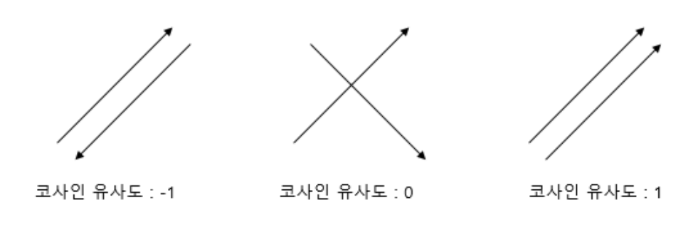

# NLP 용어 사전

<br>

<br>

#### 1. `벡터 공간 (vector space)`

- 선형대수학에서 벡터 공간 (vector space) 또는 선형 공간 (linear space)은 원소를 서로 더하거나, 주어진 배수로 늘일 수 있는 공간이다
- 선형 연산에 대해 닫혀 있는 집합을 말한다
  - 여기서 "닫혀 있다"는 집합에 있는 원소들에 대한 선형 연산의 결과가 모두 그 집합에 포함된다는 것을 의미한다
    - 즉, 집합의 원소들의 **선형 결합 (linear combination)** 이 항상 다시 집합에 포함되어야 한다

- 다음 조건을 만족하는 벡터 집합 𝑉를 벡터 공간이라고 한다

  (u, v, w는 𝑉에 속하는 임의의 vector이고, c, d는 임의의 scala이다)

  ```
  (1) u + v ∈ 𝑉
  (2) u + v = v + u
  (3) (u + v) + w = u + (v + w)
  (4) u + 0 = u를 만족하는 영벡터가 𝑉의 원소이다.
  (5) u + (−u) = 0을 만족하는 벡터 u가 𝑉의 원소이다.
  (6) cu ∈ 𝑉
  (7) c(u + v) = cu + cv
  (8) (c + d)u = cu + du
  (9) c(du) = (cd)u
  (10) 1u = u
  ```

- 벡터 공간 예시
  - 𝑅^𝑛 (𝑛≥2)
    - 실수는 사칙 연산에 대해 닫혀 있고, **항등원**과 **역원**이 존재하므로 (1) ~ (10)이 모두 성립한다

<br>

#### 2. `벡터 (vector)와 행렬 (matrix)의 미분 (derivative)`

#### 3. `벡터의 내적 (inner produt)과 코사인 유사도 (cosine similarity)`

- **코사인 유사도**

  

  - 벡터 간의 코사인 각도를 이용하여 구할 수 있는 두 벡터의 유사도를 의미한다
  - 두 벡터의 방향이 완전히 동일한 경우 1의 값을 가지고, 90도의 각을 이루면 0, 180도로 반대의 방향을 가지면 -1의 값을 갖게 된다
    - 즉, 코사인 유샤도는 -1 이상 1 이하의 값을 가지며, 값이 1에 가까울수록 유사도가 높다고 판단할 수 있다

<br>

#### 4. `고유 분해 (eigendecomposition)`

#### 5. `우도 함수 (likelihood function)와 최대우도추정 (maximum likelihood estimation)`

- **우도**란?
  - 나타난 결과에 따라 여러 가능한 가설들을 평가할 수 있는 측도 (measure)
- **최대 우도**란?
  - 일어날 우도 (가능성)이 가장 큰 것
- **최대 우도 추정법**이란?
  - 모수가 미지의 θ (*theta*)인 확률 분포에서 뽑은 표본 x들을 바탕으로 θ (*theta*)를 추정하는 기법이다
    - 데이터와 모델, 추정치의 값이 가장 좋은 순간을 알기 위한 방법
      - *어떤 확률이 나타나기 가장 적절한 상태는 무엇인가*
  - 특징
    - 표본의 수가 충분히 클 때는 바람직한 통계적 속성 (일치성, 최량 점진적 정규성)을 갖는다
  - 장점
    - 계산이 쉽고, 직관적이다
  - 사용되는 곳
    - 관심이 있는 **확률 변수** 또는 모수(**확률분포 특성치**)에 대해서 사전 정보를 필요로 하지 않는 **통계적 추정 과정**으로 사용된다
    - 모집단이 어떤 종류의 확률 분포를 하는지는 알고 있으나, 구체적으로 모집단을 나타내는 수치 (**모수**, **확률**, **변수**)를 모르는 경우에 사용한다


<br>

#### 6. `엔트로피 (entropy)`

#### 7. `크로스 엔트로피 (cross entropy)`

#### 8. `그래디언트 디센트 (gradient descent)`

#### 9. `사전확률 (prior probability)와 사후확률 (posterior probability)`

#### 10. `선형회귀 (linear regression)`

#### 11. `이항 로지스틱 회귀 (binomial logistic regression)와 시그모이드 (sigmoid) 함수`

#### 12. `다항 로지스틱 회귀 (multinomial logistic regression)와 소프트맥스 (softmax) 함수`

#### 13. `피드포워드 뉴럴 네트워크 (feedforward neural network)`

#### 14. `CNN (Convolutional Neural Network)`

#### 15. `RNN (Recurrent Neural Network)`

#### 16. `Window size`

- 한 번에 받을 수 있는 데이터의 양
